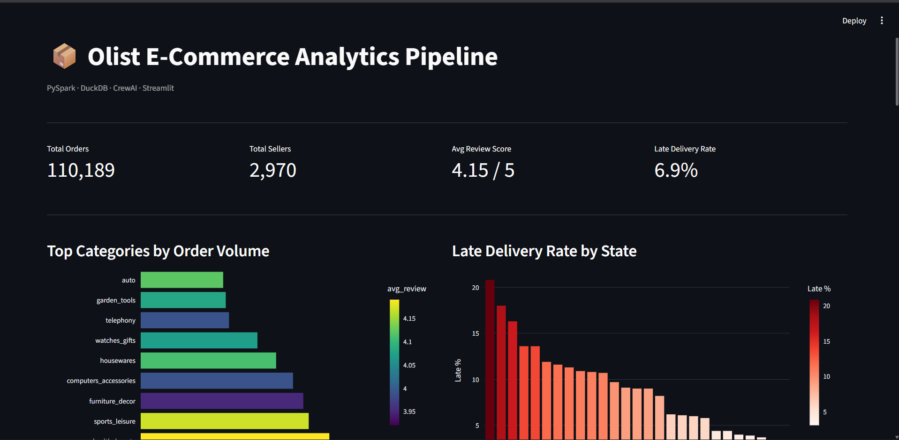

# Olist E-Commerce Analytics Pipeline

An end-to-end data engineering and analytics project built on the Brazilian Olist e-commerce dataset. Ingests and transforms 100K+ orders using PySpark, stores analytics in DuckDB, generates AI-powered business reports via LLM agents, and serves everything through an interactive Streamlit dashboard.

**Live demo:https://olist-analytics-pipeline-bzpmqsg6ikp299gwejf4xg.streamlit.app/**



## Architecture

```
Raw CSVs (9 datasets)
    ↓ PySpark (ingest + clean + feature engineering)
    ↓ DuckDB (fast analytical storage)
    ↓ Groq LLM Agents (analyst + anomaly + reporter)
    ↓ Streamlit Dashboard (KPIs + charts + AI report)
```

## Tech Stack

| Layer | Technology |
|---|---|
| Data Processing | PySpark 3.x |
| Storage | DuckDB |
| AI Agents | Groq LLaMA 3 (via Groq API) |
| Dashboard | Streamlit + Plotly |
| Orchestration | Python pipeline |

## Project Structure

```
olist-analytics-pipeline/
├── spark_jobs/
│   ├── ingest.py              # Load 9 raw CSVs into PySpark
│   ├── clean.py               # Merge, clean, type-cast master dataset
│   └── feature_engineer.py    # Order, seller, category, customer features
├── db/
│   └── loader.py              # Load parquet → DuckDB tables
├── crew/
│   └── pipeline_crew.py       # 3 LLM agents: analyst, anomaly, reporter
├── dashboard/
│   └── app.py                 # Streamlit dashboard
├── data/
│   ├── raw/                   # Olist CSVs (not tracked in git)
│   └── processed/             # Parquet feature tables
├── reports/
│   └── olist_report.md        # AI-generated business report
├── requirements.txt
└── .env
```

## Features

- **PySpark pipeline** — ingests and cleans 9 Olist CSV datasets, engineers 4 feature tables (order, seller, category, customer level)
- **DuckDB storage** — sub-second SQL queries on 100K+ rows without a database server
- **3 LLM agents** — Analyst Agent (KPI insights), Anomaly Agent (risk flags), Reporter Agent (executive markdown report)
- **Streamlit dashboard** — KPI cards, 4 interactive Plotly charts, high-risk seller table, on-demand AI report generation

## Setup

### Prerequisites
- Python 3.10+
- Java 17 or 21 (for PySpark)
- Groq API key (free at https://console.groq.com)

### Installation

```bash
git clone https://github.com/asanepranav/olist-analytics-pipeline
cd olist-analytics-pipeline

python -m venv venv
venv\Scripts\activate  # Windows
pip install -r requirements.txt
```

### Environment Variables

Create `.env` in project root:
```
GROQ_API_KEY=your_groq_api_key_here
```

### Data

Download the [Olist Brazilian E-Commerce dataset](https://www.kaggle.com/datasets/olistbr/brazilian-ecommerce) from Kaggle and place all CSVs in `data/raw/`.

### Run Pipeline

```bash
# Step 1 — ingest raw data
python spark_jobs/ingest.py

# Step 2 — clean and merge
python spark_jobs/clean.py

# Step 3 — feature engineering
python spark_jobs/feature_engineer.py

# Step 4 — load into DuckDB
python db/loader.py

# Step 5 — generate AI report
python crew/pipeline_crew.py

# Step 6 — launch dashboard
streamlit run dashboard/app.py
```

## Results

- Processed **110,189 orders** across 9 merged datasets
- Engineered **4 feature tables**: 96K orders, 2.9K sellers, 72 categories, 27 states
- AI agents surface **delivery risk by state**, **underperforming sellers**, and **category revenue opportunities**
- Dashboard loads in **<2 seconds** via DuckDB

## Dataset

[Brazilian E-Commerce Public Dataset by Olist](https://www.kaggle.com/datasets/olistbr/brazilian-ecommerce) — 100K orders from 2016–2018, released under CC BY-NC-SA 4.0.
